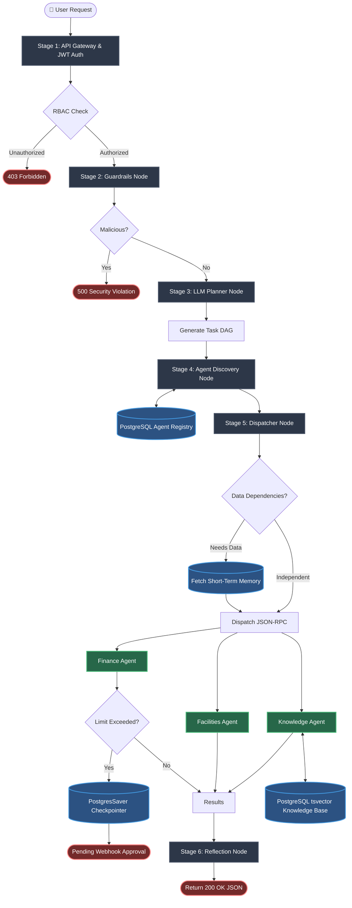

# Enterprise Orchestration Flow

Here is the high-level architectural flow of your platform, explaining how a user's request travels through the system from start to finish. You can use this diagram to explain the core logic to your mentor.

### Stage Summary:
1. **API Gateway:** Intercepts the request and checks the JWT token for valid scopes.
2. **Guardrails:** Scans the raw text for SQL injections or forbidden prompts.
3. **Planner:** Uses the Groq LLM to decompose the request into an ordered Directed Acyclic Graph (DAG) of tasks.
4. **Discovery:** Queries PostgreSQL to find out exactly where the required agents are currently hosted.
5. **Dispatcher:** Injects short-term memory (outputs from previous tasks) into current tasks and fires HTTP requests to the distributed agents. Handles compliance halts (Pending Approval).
6. **Reflection:** Aggregates all the successful agent outputs into a unified response for the user.
